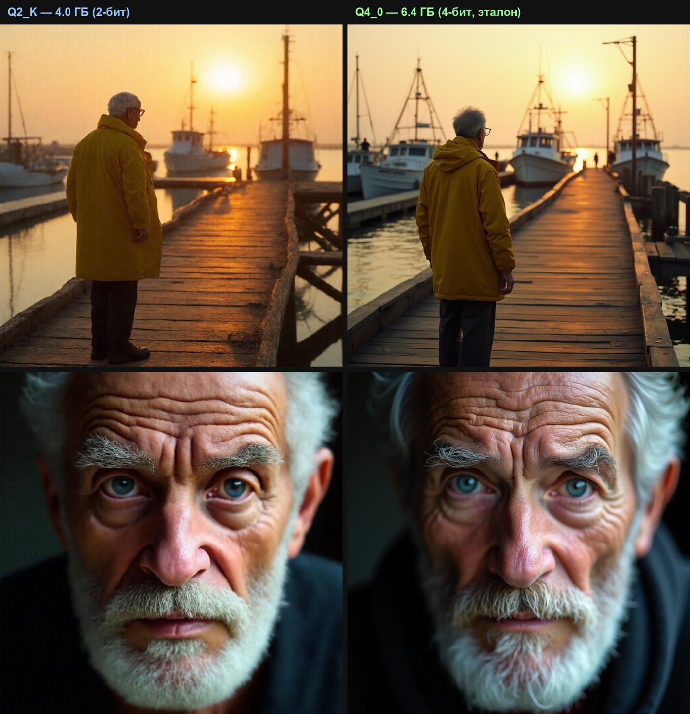

# Жматель (XQuant) — свой квантайзер диффузионных моделей (без чужого движка)

[🇬🇧 English](README.md) · **🇷🇺 Русский**

Жмёт диффузионные модели (FLUX / SDXL / SD1.5 / SD3 / Qwen-Image / Wan …) в
**2 / 3 / 4-битный GGUF** движком, написанным **с нуля** — своё GGML-байт-точное
ядро, свой GGUF-писатель, своя детекция архитектуры. Кидаешь `bf16`/`fp16`-модель,
получаешь сжатый `.gguf`, который работает в ComfyUI.

## Два режима

**🏆 Premium — `safetensors (bf16) → Q4_0`.** Бескомпромиссно, журнальное качество.
Модель худеет ~в 4 раза, но рендерит неотличимо от оригинала, потому что квантайзер
работает от **полноточного источника** и держит критические слои (входные
эмбеддинги, выходную проекцию в VAE, нормы) в `bf16` **прямо из этого источника** —
ничего лоссового их не касается. Это режим для реального качества генерации.

**♻️ Eco / Аварийный — `GGUF → GGUF`.** Сверхбыстрое **локальное** пере-сжатие
модели, которая *уже есть* как `.gguf` — не надо перекачивать 15–24 ГБ оригинала.
Читает любой исходный квант (`Q4_K_M`, `Q6_K`, …), перепаковывает меньше, сохраняет
токенайзер/метадату дословно. Для **слабых ПК и медленного интернета**: экономь диск
за минуты, без гигантских загрузок. Качество ограничено источником (реквант уже
лоссового = двойная потеря) — это для *места*, не для *максимума качества*.

> Правило: **Premium**, когда есть `bf16`/`fp16` оригинал и нужна лучшая картинка;
> **Eco**, когда есть только `.gguf` и надо быстро сделать его меньше.

## Ноль чужого движка
Standalone-движок зависит **только от numpy** — ни `llama.cpp`, ни `gguf`-библиотеки,
ни City96 `convert.py`, ни torch:
- **`xquant.py`** — ядро квантования с нуля. Наш `Q4_0` **байт-в-байт совпадает** с
  GGUF-эталоном; `Q3_K` / `Q2_K` проверены round-trip'ом через декодер ComfyUI-GGUF.
- **`xgguf.py`** — свой писатель GGUF v3 (проверен независимым GGUF-ридером).
- **`xquant_standalone.py`** — свой ридер safetensors (ручной декод `bf16`/`fp16`/
  `fp8`) + своя детекция архитектуры. **Ни строчки чужого квантайзера.**

## Реквантизация LLM (GGUF → GGUF, без перекачки)
Кидаешь готовый **LLM GGUF** (из LM Studio и т.п.) и жмёшь его дальше — не надо
качать сырые 15 ГБ safetensors. Жматель читает GGUF, распаковывает веса в RAM,
применяет защиту критических слоёв и перепаковывает в любой 2/3/4/5/6/8-бит,
**сохраняя всю метадату и токенайзер** дословно (raw KV passthrough) — результат
грузится в llama.cpp / LM Studio.

**Любой исходный квант распаковывается** — наши numpy-дескванты для
`Q4_0` / `Q5_0` / `Q2_K` / `Q3_K` / `Q4_K` / `Q5_K` / `Q6_K` / `Q8_0` / `F16` /
`BF16` / `F32` **байт-в-байт совпадают** с эталоном `gguf` (`dequantize`), так что
даже `Q4_K_M` из LM Studio перепакуется корректно.
```
XQuant.exe model-Q4_K_M.gguf Q3_K     # готовый LM-Studio квант → меньше, токенайзер цел
```
Лучший источник всё же **F16 или Q8_0** — реквант уже-лоссового K-кванта
(например `Q4_K_M → Q2_K`) копит ошибку (двойная потеря); тул предупреждает, когда
источник уже низкобитный.

## Универсальная защита критических слоёв
Входные эмбеддинги, выходная проекция в VAE (`final_layer` / `conv_out` /
`proj_out`) и нормы держатся в `bf16` для **любой** архитектуры — так связь с VAE
не рвётся (классический суб-4-бит «цветной шум»).

## Умное распределение бит — SMART (включено по умолчанию)
Не каждый слой заслуживает одинаковой битности. Перед записью XQuant прогоняет
дешёвый **Q4-зонд** по каждому 2-D весу и меряет *абсолютную* ошибку
восстановления `‖W − dequant(quant(W))‖` — насколько слой реально сопротивляется
кванту. Затем **перераспределяет биты размер-нейтрально**:

- **тяжёлые / важные слои → ступень вверх** (напр. `Q4_0 → Q5_0`) — бережём;
- **лёгкие / «тупые» слои → ступень вниз** (напр. `Q4_0 → Q3_K`) — жмём;
- байты, потраченные на апгрейд, покрываются байтами, освобождёнными даунгрейдом →
  **тот же размер файла, меньше суммарного искажения.**

Работает без калибровки (data-free) — важность читается прямо из весов, в духе
AWQ «береги значимые веса, остальное жми сильнее». На реальном FLUX.1-dev с базой
`Q4_0` поднимает ~40 важных слоёв и опускает ~90 малозначимых при **нулевом
изменении размера**; на синтетике режет суммарное искажение весов **~19 % при том
же размере**. Действует для любой базы `Q2_K…Q6_K`. Отключить: `XQUANT_SMART=0`.

**Режимы** (дроп-даун в GUI или `XQUANT_SMART_MODE=`):

| режим | что делает | итог |
|---|---|---|
| **⚖ Баланс** (по умолч.) | бережём важные / жмём тупые, размер-нейтрально | тот же размер, лучше картинка |
| **🤏 Ширинка** | давим тупых сильнее — самые тупые на **две ступени вниз** (`Q4_0→Q2_K`), апгрейдов мало | **файл меньше**, важные целы |
| **📦 Q3** | умеренно тянем тупые вниз, важные бережём — цель ≈ Q3-размер при живой картинке | **компактный**, держит качество |
| **🔥 Экстрим-ширинка** | давим ~85% слоёв вниз, большинство на две ступени | **самый маленький файл**, качество в жертву размеру |
| **💎 Качество** | поднимаем больше важных слоёв, даунгрейдов мало | чуть больше, максимум качества |
| **▦ Плоский** | равномерный квант без перераспределения | как раньше |

**Реальные размеры (FLUX.1-dev):** `Q2_K` ≈ **4.5 ГБ**, `Q3_K` ≈ **5.3–5.8 ГБ**, `Q4_0` ≈ **6.3 ГБ**.
Главная экономия по размеру — это **Q2_K (−29 %)**, а не Q3 (Q3 экономит лишь 0.5–1 ГБ против Q4).

**Вывод визуального теста (2026-07-19):** метрики (косинус / взвешенная ошибка) **сильно
преувеличивают** ущерб низкого бита. Взвешенная ошибка кричала «Q3 = 413 % от Q4» — а по
фото Q3 совершенно юзабелен, картинка не разваливается. imatrix даёт видимый выигрыш (чище
кожа, без артефактов), сильнее всего — на **Q2** (там imatrix бережёт активационные выбросы,
которые data-free методы не видят). Судить о качестве надо **глазами, а не метрикой**.

## imatrix — важность по активациям (уровень AWQ)
SMART берёт важность из *весов*. **imatrix** — из *активаций*, реального сигнала
через слой, и именно это держит низкий бит. С imatrix по-групповой солвер
(`Q2_K`/`Q3_K`) взвешивает каждый входной канал по `sum(акт²)`, а не по `x²`:

- На синтетике Q2_K активационно-взвешенная ошибка падает **~55%**.
- **Q2 становится юзабельным** (~4ГБ вместо 6.8 на Q4), картинка держится;
  **Q3 перестаёт зернить.** Это и есть рычаг «сильно меньше И качество сохранено».

**Как собрать — два способа:**

1. **Скрипт `collect_imatrix.py` (без ноды ComfyUI)** — запусти его (или двойной клик
   `Собрать-imatrix.bat`) на окружении с CUDA-torch + diffusers (напр. `python_embeded`
   от ComfyUI-portable). Он гоняет несколько прогонов трансформера flux на разных
   промптах, хуками копит важность и пишет `<model>.imatrix.npy`:
   ```
   python collect_imatrix.py --model black-forest-labs/FLUX.1-dev --out flux1-dev.imatrix.npy
   ```
   > На новых torch (cu13x) `cpu_offload` может ронять хуки в segfault — скрипт этого
   > избегает, держа на GPU только трансформер (~24 ГБ, влезает в 24-32 ГБ карту).
2. **Нода ComfyUI** — поставь **XQuant imatrix: Capture** перед `KSampler` и **Save**
   после, прогони 1–3 генерации → `<model>.imatrix.npy`.

Укажи файл в `XQuant.exe` (поле 🎯 imatrix) или `XQUANT_IMATRIX=<путь>`. Композится с
**любым** режимом — сочетай с 🤏 Ширинкой / 🔥 Экстримом для самого маленького файла,
что ещё выглядит хорошо. Без imatrix — откат на важность по весам (`x²`).

## Совместимость с LoRA
Квант базовой модели **не ломает** LoRA. LoRA — отдельная низкоранговая дельта,
накладываемая поверх весов на этапе вычисления:

```
W' = W_quant  +  (B·A)·scale
     ↑ Q4/Q2 база   ↑ LoRA остаётся fp16, добавляется поверх разжатой базы
```

Квант трогает только **базовые** веса; матрицы LoRA остаются полноточными, и их
поправка добавляется на лету (ComfyUI-GGUF разжимает базу по-операции и применяет
дельту). LoRA — аддитивная поправка, устойчивая к малому сдвигу базы от кванта:
fp16-обученная LoRA работает на Q4- (даже Q2-) базе. Проверено в продакшене:
identity-LoRA на Q4 FLUX работает как надо. **Единственное**, что ломает LoRA — это
*вмерживание* её в веса с последующим реквантом (двойная потеря); держи раздельно:
`Q4 gguf + fp16 LoRA`.

## Результаты (FLUX.1-dev, живой side-by-side рендер, тот же промпт+сид)
| бит | размер | вердикт |
|---|---|---|
| fp16 | 23.8 ГБ | эталон |
| **4-бит Q4_0** | **6.4 ГБ** | ✅ **рекомендуется — стабильно, качественно, неотличимо от fp16** |
| 3-бит Q3_K | ~5–6 ГБ | ❌ видимое зерно — хуже Q2 при бОльших битах; не рекомендуется |
| 2-бит Q2_K | 4.0 ГБ | тоже чисто (пейзажи + крупные лица ≈ Q4), чуть мягче мелкие детали |

**Q4_0 — выбор по умолчанию: максимум качества при реальной стабильности** — на нём
работает боевой бот. Q2_K — приятный сюрприз (чисто при 4.0 ГБ, отлично когда VRAM
впритык или фейс-своп всё равно перекроет базовое лицо). Q3_K — белая ворона: наш
симметричный 3-бит зернит сильнее 2-бита, так что пропускаем.

> ⚠️ **Вес-PSNR — ненадёжный рейтинг качества.** По вес-ошибке Q3_K выглядит «лучше»
> Q2_K, а живые рендеры показывают обратное. Верь картинке (кнопка **🖼 Реал-тест**),
> а не числу.

**Пол пост-тренировочного кванта ≈ 2 бита.** Ниже (тернар 1.6-бит) качество рушится
без обучения-с-учётом-кванта.

### Витрина — 2-бит vs 4-бит (FLUX.1-dev)


Слева **Q2_K (4.0 ГБ)**, справа **Q4_0 (6.4 ГБ)** — тот же промпт, тот же сид. Даже на
2 битах рендер чистый: прямые мачты, чёткие доски, без зерна в небе; крупный план
держит поры кожи, пряди бровей/бороды и блики в глазах. Q4_0 чуть острее на самых
тонких волосках, за +2.4 ГБ.

> **Честная оговорка:** это витрина *качества*, а не пиксель-в-пиксель A/B. 2-бит
> возмущает веса достаточно, чтобы тот же сид пошёл чуть другой латентной траекторией
> (мужчина поворачивается иначе), так что два кадра — не одна композиция; они
> показывают, что 2-бит держит *достоверность*, а не воспроизводит точный fp16-кадр.
> Q2_K тут — стандартный GGML Q2_K, просто хорошо закодированный с защитой критических
> слоёв от bf16-источника — без магии, просто крепкая инженерия.

## Исследование — как FLUX умирает на 1 бите
Отдельный практический разбор пределов ниже Q2_K: что происходит, когда бинаризуешь
FLUX.1-dev в **1 бит** этим движком. Коротко — чистый 1-бит не работает, но умирает
тремя разными структурными способами (схлопывание-в-среднее **пустота**, взрыв
дисперсии **шум**, потеря пространственной сборки **ткань**), и **attention оказался
куда более хрупким, чем MLP** (бинаризация 12% весов как attention убивает модель;
24% как MLP оставляет её чистой). Судим по картинкам, а не по вес-косинусу (он врёт).

Плюс: attention удалось **оживить без обучения** ортогональной «коробкой» (incoherence-
поворот), а вот **adaLN — стена**, которую коробка не бьёт (проблема магнитуд, не выбросов).
Полный разбор, метод и картинки: **[RESEARCH-1bit-flux.ru.md](RESEARCH-1bit-flux.ru.md)**.

> Честный сторож: это **лог экспериментов**, а не победа по сжатию — «живые» прогоны
> эффективно ~10–14 бит (жирнее Q2_K). Это *карта хрупкости*, а деплой-дно остаётся Q2_K.

## Использование
**Проще всего — standalone `XQuant.exe`** (20 МБ, Python не нужен, numpy внутри):
перетащи `.safetensors`-модель на `XQuant.exe` → получишь `<модель>-Q2_K.gguf` рядом.
Или из терминала: `XQuant.exe <model.safetensors> [Q4_0|Q3_K|Q2_K]`.

Через Python:
```
python xquant_standalone.py <model.safetensors> [Q4_0|Q3_K|Q2_K]
```
Результат: `<модель>-<qtype>.gguf` рядом с исходником.

## Тест качества (какую битность взять)
В GUI есть кнопка **🧪 Тест качества**. Она сэмплит крупнейшие весовые тензоры и для
каждой битности квантует → разжимает → выдаёт ошибку реконструкции и PSNR с простым
вердиктом — всё офлайн (без GPU, без генерации), за секунды. Вердикты откалиброваны
по живым FLUX-A/B:

```
бит    байт/вес   отклонение   PSNR      вердикт
Q8_0   1.06        0.6%        69 dB     безупречно
Q4_0   0.56        8.9%        45 dB     чисто, без видимых потерь
Q3_K   0.43       18.6%        39 dB     видимое зерно
Q2_K   0.33       33.3%        33 dB     сильное зерно / муть
```
Вес-PSNR не линеен к качеству картинки, поэтому пороги подогнаны так, чтобы «чисто»
кончалось там, где рендеры FLUX реально начинают зернить — Q4_0 практический пол для
неотличимого FLUX.

### Тест реальной генерацией (🖼)
Если локальный ComfyUI запущен (`:8000` или `XQUANT_COMFY_URL`), кнопка **🖼 Реал-тест**
генерит *тот же* промпт+сид на каждом сжатом кванте твоей модели, что найдёт в ComfyUI
(FLUX; авто-детект CLIP/VAE), и показывает реальные кадры рядом — живое фото-A/B, а не
только PSNR. Сожми битности сперва, потом жми её.

## Загрузка в ComfyUI
Скопируй `comfyui-node/ComfyUI-XQuant` в `ComfyUI/custom_nodes/`. Появится
**`XQuant GGUF Loader`** — выбираешь `.gguf`, он разжимает при загрузке и строит модель
родными средствами ComfyUI (`load_diffusion_model_state_dict`), так что архитектура
(FLUX / SD3 / SDXL / …) определяется по ключам тензоров сама. Наш `Q4_0` GGUF также
нормально грузится штатным `UnetLoaderGGUF` от City96.

### Аудио / музыкальные модели
Ядро кванта архитектуро-независимо, так что жмёт и аудио-диффузию / музыку. Загвоздка
в **загрузчике**, не в сжатии:
- Модель **уже в GGUF** (музыкальные LLM, Whisper, MusicGen-GGUF) → путь `.gguf → .gguf`
  уменьшает её, и она работает в родном llama.cpp / whisper.cpp **уже сегодня**.
- **Аудио-диффузия в `.safetensors`** (Stable Audio, ACE-Step) → Жматель сожмёт её
  (тег арх `unknown`), а нода **`XQuant Music Loader`** загрузит обратно. ComfyUI сам
  распознаёт Stable Audio (по `transformer.rotary_pos_emb.inv_freq`) и ACE-Step (по
  `genre_embedder.weight`) из восстановленного state-dict, так что сжатый DiT грузится
  через ту же диффузионную машинерию (KSampler → `VAEDecodeAudio`). VAE/кондиционер
  грузи отдельно, как обычно. GPT-класс музыки (Bark, MusicGen) — **не** диффузия,
  им нужен свой рантайм, через эту ноду они не загрузятся.

Проверено: сжатие реальной аудио-модели (Bark) работает end-to-end (1.8 → 0.3 ГБ,
валидный GGUF). Путь Music Loader переиспользует ровно тот механизм дескванта+загрузки,
что доказан на FLUX; проверь на своём Stable Audio / ACE-Step чекпойнте.

## Лицензия — AGPL-3.0
Под **GNU AGPL-3.0**. Любой, кто использует, изменяет или обслуживает этот код по
сети, **обязан открыть свой полный исходник под той же лицензией.** Коммерческое
закрытое использование не разрешено.

*(Опциональный вариант `xquant_tool.py` переиспользует City96 `convert.py` из
ComfyUI-GGUF, Apache-2.0 — см. `NOTICE`. Standalone-движок выше не использует ничего
из этого.)*

## Контакты
По **коммерческой лицензии** и кастомной интеграции — пиши в Telegram:
**[@GarrysmodMapper](https://t.me/GarrysmodMapper)**.

Попробуй модели в деле — наш Telegram AI-бот для картинок:
**[t.me/comfuibot](https://t.me/comfuibot)** (генерация картинок и видео FLUX / Qwen,
на тех самых квантах, что делает этот тул).
